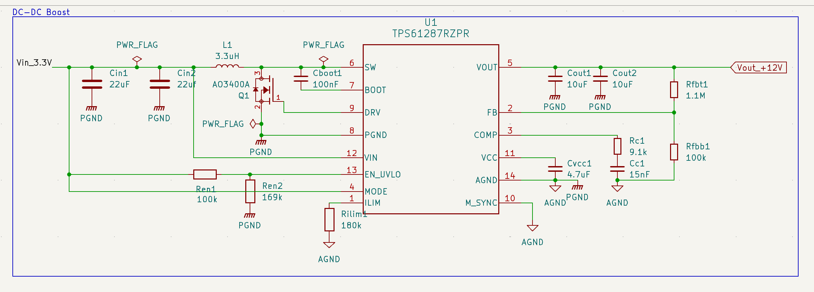
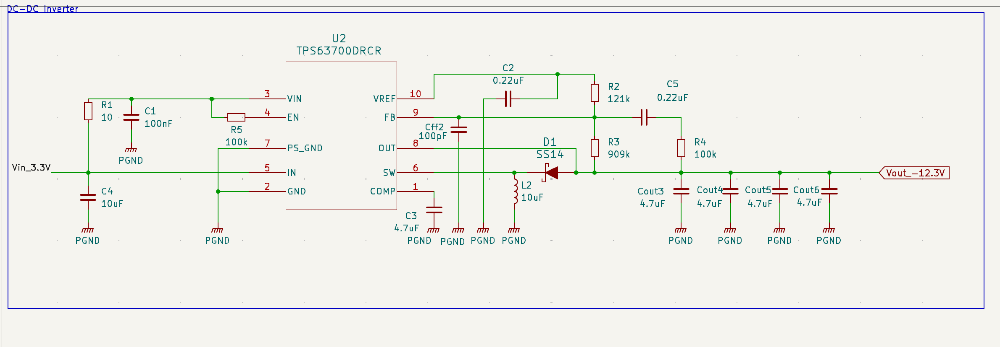
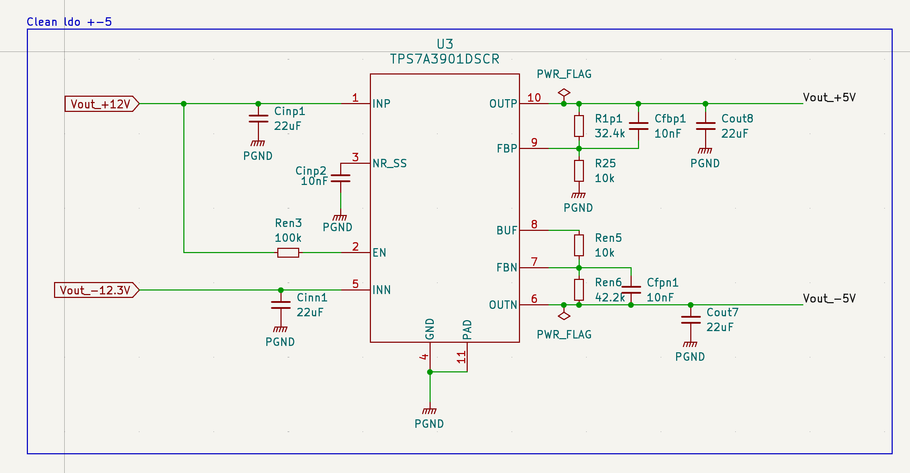

# Dev Log – `clean-analog-supply`

**Project:** 3.3–5 V input → ±12 V → ±5 V low-noise analog power supply  
**Start date:** 2025-04-09

---

## Day 1 – 2025-04-09

- Finalized core architecture:
  - Boost: 3.3–5 V input → +12 V  
  - Inverter: 3.3–5 V input → –12 V  
  - LDO: ±12 V → ±5 V clean analog rails (TPS7A39)

- Created GitHub repository and organized structure

- Selected main components:
- Boost converter: **TPS61287** — +12 V @ 1 A from 3.3–5 V
- Inverting converter: **TPS63700** — –12 V from same input
- LDO: **TPS7A39** — ultra-low-noise dual-channel linear regulator for ±5 V

- Architecture rationale:
- Clean symmetric rails required for op-amps and analog stages
- LDO ensures low noise and high PSRR
- Chose symmetry and analog performance over minimal BOM

---

## Day 2 – 2025-04-10

- Completed full schematics for:
- Boost stage (TPS61287)
- Inverter stage (TPS63700)
- LDO stage (TPS7A39)

- Wrote calculation files:
- `boost.md` — complete
- `inverter.md` — complete
- `ldo.md` — in progress

- Schematic captures:

### Boost Converter – TPS61287

### Inverter – TPS63700

### LDO ±5 V – TPS7A39

- Next steps:
- Define net classes (power, AGND, PGND, signals)
- Begin PCB layout with controlled trace widths and return paths
